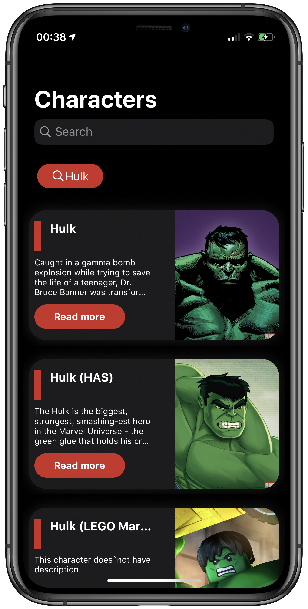
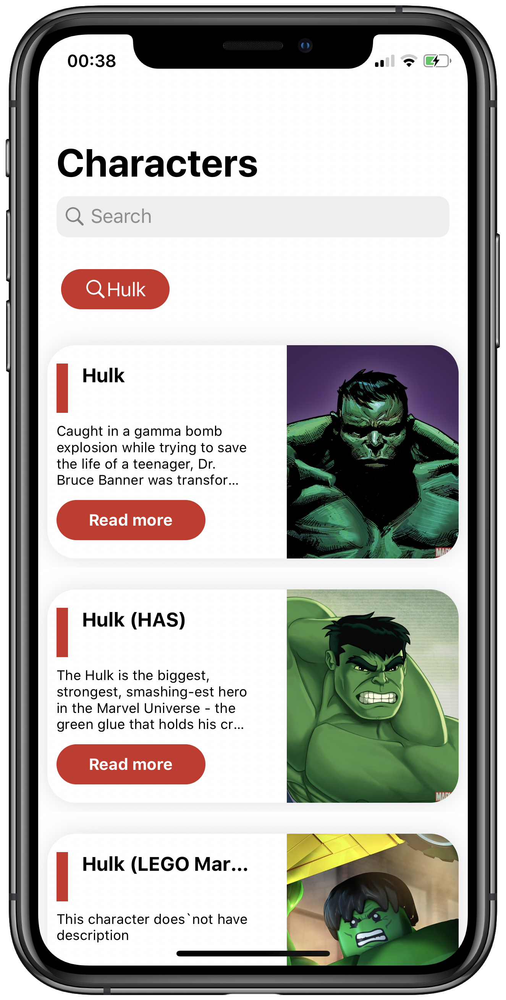
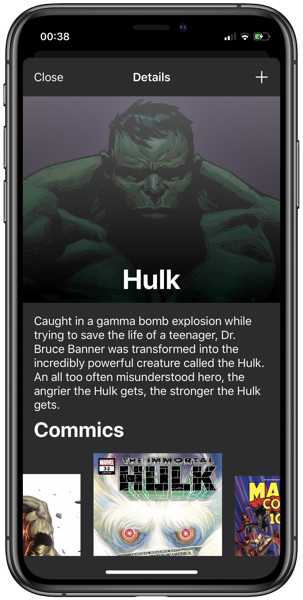
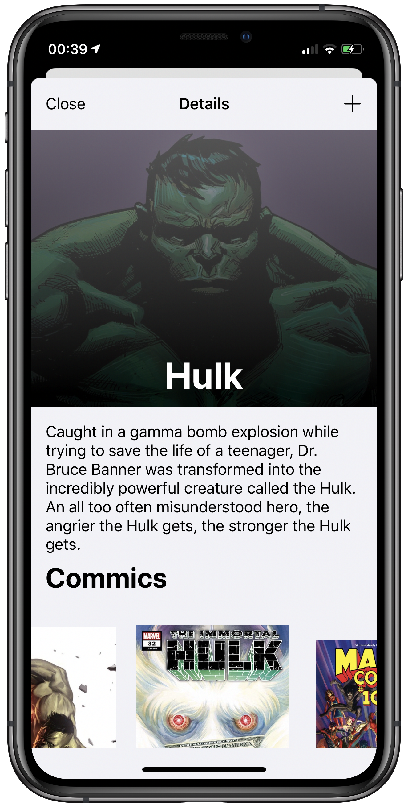

<h1 align="center">Marvel App</h1>

    
    
    
    
    

This application is a example of my knowledge with Swift 5.0 using architecture MVVM-C and unit tests. 
I used Fastlane and Bitrise as continuous integration tool and use library Kingfisher for cache and image download.

## ❗️Requirements

- iOS 13.2+
- Swift 5.0
- Carthage

## 📸 Screenshoots

The application offers supports  dark mode

 
 
 

## 🧩 How to build

Before of build, run in terminal the command  `carthage update` and check your version of xcode, this is app only build in xcode 11.3.1+.

## 📱 Contacts

if you has interested contact me, just send a message in my  [`LinkedIn`](https://www.linkedin.com/in/danielrsousa/)

Thanks

